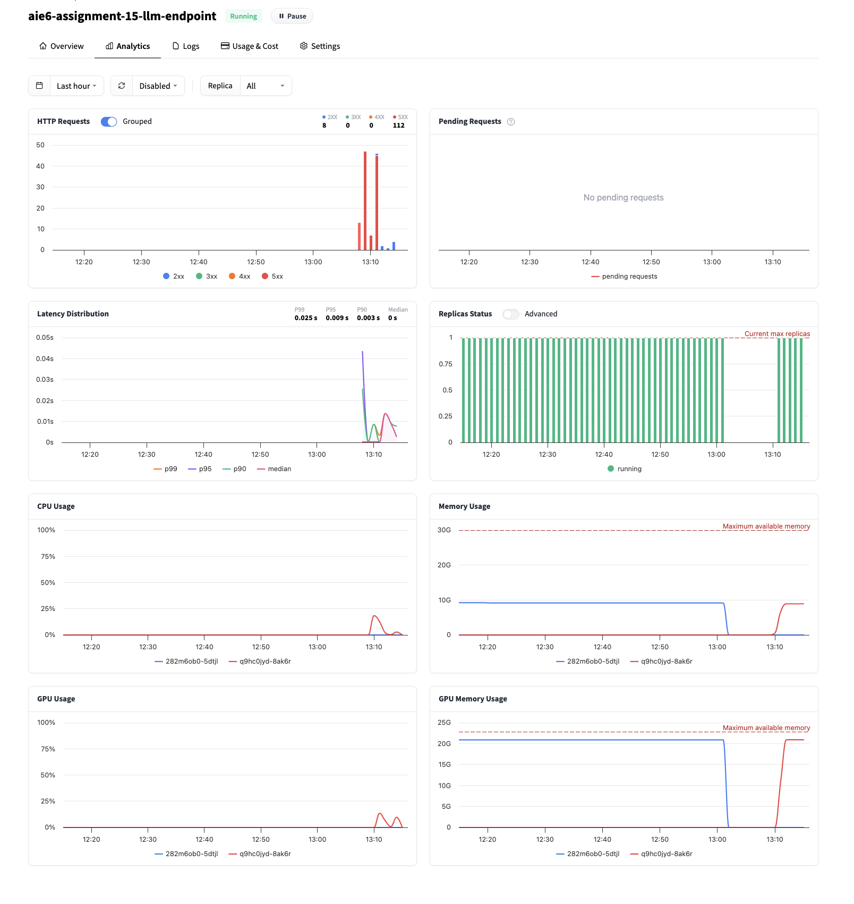
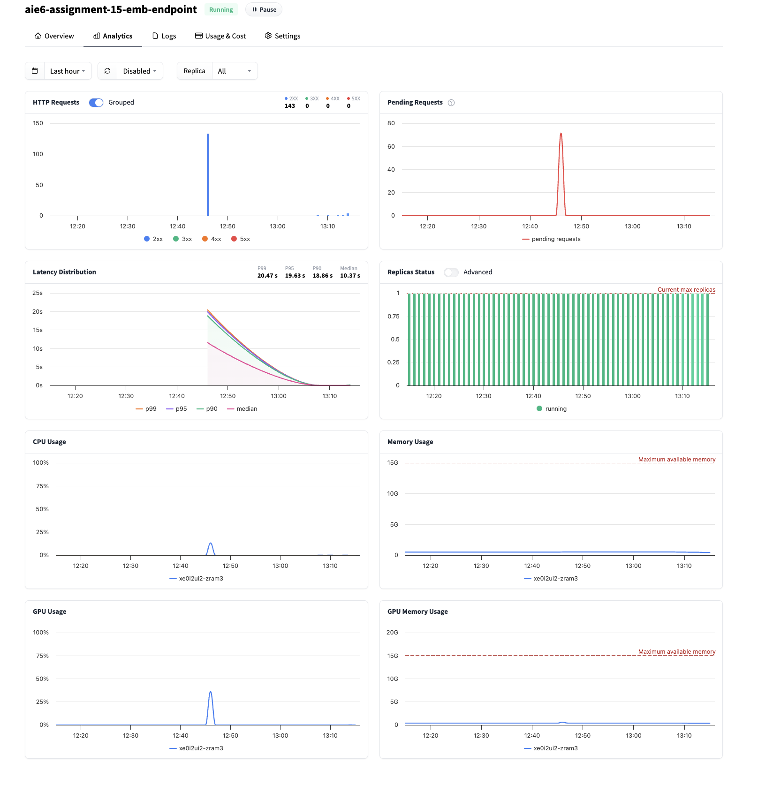

In today's assignment, we'll be creating an Open Source LLM-powered LangChain RAG Application in Chainlit.

There are 2 main sections to this assignment:

## Build 🏗️

### Build Task 1: Deploy LLM and Embedding Model to SageMaker Endpoint Through Hugging Face Inference Endpoints - DONE

I followed the steps Chris showed in class and was able to create endpoints for both LLM and Embedding Model.

### Build Task 2: Create RAG Pipeline with LangChain - DONE

Follow the notebook to create a LangChain pipeline powered by Hugging Face endpoints! This was just plugging in my endpoints and running the notebook - it ran successfully.

Once you're done - please move on to Build Task 3!

### Build Task 3: Create a Chainlit Application - DONE

Here is my huggingface space: https://huggingface.co/spaces/geetach/aie6-assignment-15-geeta (it won't work once I bring the endpoints down)

### Deliverables (DONE - showcased in my loom video)

- Completed Notebook - on github. 
- Chainlit Application in a Hugging Face Space Powered by Hugging Face Endpoints - on hugging face. I will show this in my loom video, but I assume it will stop working once I stop my endpoints as instructed.
- Screenshot of endpoint usage - DONE

Screen shot of LLM endpoint usage: 
Screen shot of Embedding endpoint usage: 

## Ship 🚢

Create a Hugging Face Space powered by Hugging Face Endpoints!

### Deliverables (DONE)

- A short Loom of the space, and a 1min. walkthrough of the application in full

## Share 🚀

Make a social media post about your final application!

### Deliverables - DONE (Discord)

- Make a post on any social media platform about what you built!
